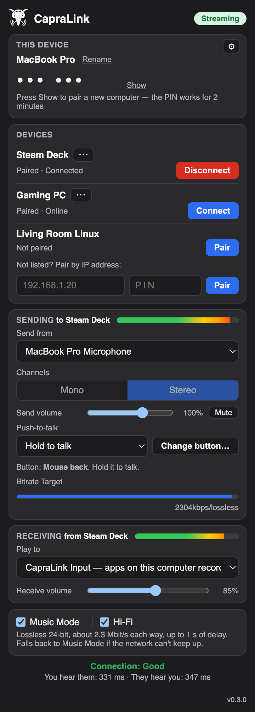
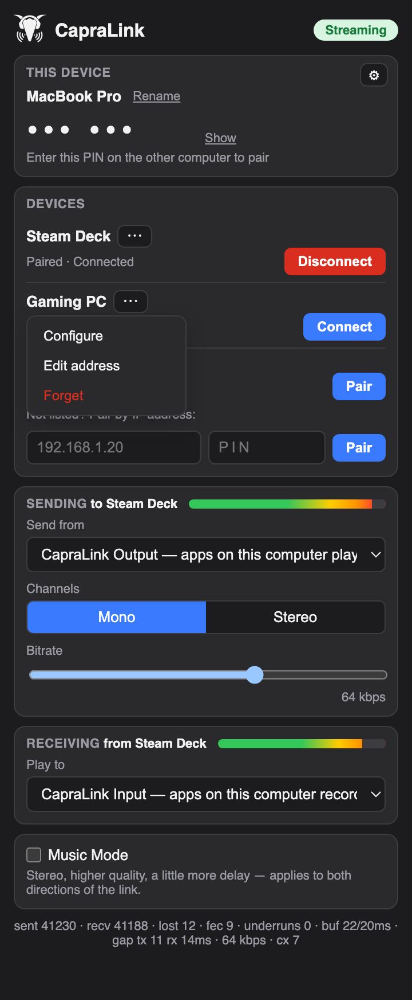
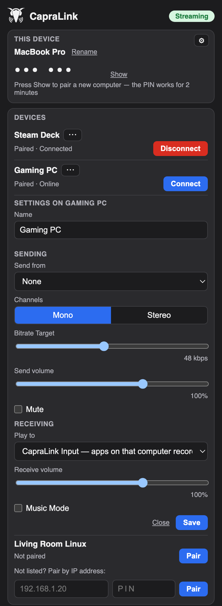

<p align="center">
  
</p>

<h1 align="center">CapraLink</h1>

<p align="center">
  Share microphones and speakers between computers on your home network.<br>
  macOS · Linux (incl. Steam Deck) · Windows
</p>

---

## What it does

CapraLink connects two computers on the same network and streams audio between them, in both
directions, with low delay. Each side picks what it sends (a microphone, or everything an app plays)
and where incoming audio goes (headphones, or a virtual microphone other apps can use).

It installs two virtual audio devices on each computer:

- **CapraLink Output** — a speaker that apps can play into. Whatever goes in is sent to the other computer.
- **CapraLink Input** — a microphone that apps can record from. Whatever the other computer sends comes out of it.

So, for example, Discord on one computer can use the other computer's headset as if it were plugged in.

## Why it exists

It started with two everyday setups:

- **Discord on the Mac, game on the Steam Deck.** The voice call runs on the MacBook, while the
  game is played on the Steam Deck across the room. The Deck should hear the call and talk into it,
  and still hear its own game.
- **The MacBook's microphone on the Windows desktop.** The desktop borrows the laptop's mic, and
  nothing needs to come back.

Cables, USB switches and audio mixers can do this, but they are fiddly and stop at the desk.
Existing network-audio tools tend to be one-way, single-platform, or too heavy to leave running
next to a game. CapraLink is meant to be set up once, stay in the tray, and get out of the way.

## Screenshots

<p align="center">
  
  
  
</p>

<p align="center"><sub>Streaming to a Steam Deck · a device's menu · changing another computer's settings remotely</sub></p>

## Features

- **Same app on every OS** — one tray app with the same window layout on macOS, Linux and Windows.
- **Pairing with a PIN** — computers find each other automatically; enter a 6-digit PIN once to pair.
  Not discovered? Pair by IP address.
- **Per-connection settings** — each computer remembers what to send and where to play for each
  paired device, and switches automatically when you connect.
- **Low delay, light on resources** — Opus audio at 48 kHz with 10 ms frames; bitrate adapts from
  8 to 96 kbps as the network changes, so games aren't affected.
- **Music Mode** — stereo and higher quality (up to 160 kbps) for music, at the cost of slightly more delay.
- **Runs in the background** — optional login service, including Steam Deck Game Mode, with no window open.
- **Remote configuration** — when allowed, change another computer's devices and settings from this one.
- **Reconnects by itself** — after a Wi-Fi drop, an IP address change or a restart.
- **Update check** — the window shows its version and offers a download link (and, where possible, one-click **Update now**) when a newer release is out.
- **Encrypted** — pairing uses SPAKE2; every session is encrypted with fresh keys (Noise + ChaCha20-Poly1305).

## Install

Download from the [Releases](../../releases) page. Check a download against `SHA256SUMS.txt`
if you like (`shasum -a 256 <file>` / `certutil -hashfile <file> SHA256`).

| | Download | Supported |
|---|---|---|
| **macOS** | `CapraLink-<version>-macOS.pkg`: the app plus the CapraLink Input/Output audio driver | macOS 12.3 or later, Apple silicon and Intel |
| **Windows** | `CapraLink_<version>_x64-setup.exe` | Windows 10 and 11, 64-bit |
| **Linux** | `.AppImage` (any distro, incl. SteamOS), `.deb` or `.rpm` | x86-64 with PipeWire or PulseAudio |

The installers aren't code-signed yet, so the first launch needs one extra step:

- **macOS:** if the package won't open, go to System Settings → Privacy & Security and
  click **Open Anyway**. Allow microphone access when CapraLink asks.
- **Windows:** if SmartScreen appears, click **More info → Run anyway**. For a CapraLink microphone,
  install [VB-Cable](https://vb-audio.com/Cable/) (free). "Everything this PC plays" needs no driver.
- **Linux:** make the AppImage executable (`chmod +x`). The virtual devices are created automatically.
  On a Steam Deck, turn on "Run in background" (⚙ in the window) to use CapraLink in Game Mode.

**Updating:** when a newer version is out, the window shows **Update now**: one click downloads
it, checks its signature, installs it and restarts CapraLink. Not available for `.deb`/`.rpm`
installs, nor on macOS when a release changes the audio drivers; there, install the new download
the usual way.

Wired Ethernet gives the smoothest audio. Wi-Fi works, with a slightly larger buffer on busy networks.

To remove the macOS audio driver: `sudo drivers/macos/uninstall.sh` from this repository, or delete
`/Library/Audio/Plug-Ins/HAL/CapraLink*.driver` and restart.

## Status

Working day to day between macOS, a Steam Deck and Windows 11. Every push also builds the
installers: see the latest run in the [Actions](../../actions) tab.

## Building from source

Needs [Rust](https://rustup.rs) (the version is pinned in `rust-toolchain.toml`) and CMake. On
Linux, also the Tauri system packages (see `.github/workflows/ci.yml`).

```bash
cargo install tauri-cli --version 2.12.0 --locked
cd app && cargo tauri build
```

macOS virtual devices:

```bash
drivers/macos/build.sh && sudo drivers/macos/install.sh
```

How it works, the security model, and what CapraLink stores and shares: [ARCHITECTURE.md](ARCHITECTURE.md).
Reporting a security problem: [SECURITY.md](SECURITY.md).

## Versioning

CapraLink follows [Semantic Versioning](https://semver.org/): versions are MAJOR.MINOR.PATCH.

- **PATCH** (0.2.0 → 0.2.1): bug fixes only.
- **MINOR** (0.2.1 → 0.3.0): new features that keep working with what came before.
- **MAJOR** (0.x → 1.0.0, then 1.x → 2.0.0): a change that breaks the public API below.

The public API, meaning what a version number promises to keep compatible, is:

1. **Computers on different versions can pair and connect** (network protocol and remote configuration).
2. **Your settings and pairings survive an update** (`config.json`).
3. **The command-line options** of `capralinkd` and of `capralink` (below).

`capralink` itself is a small client of the running engine (it never opens a window or starts the engine, and exits non-zero with a message on stderr if it can't do what you asked):

```text
capralink --status              one JSON line: connected {id, name} or null, devices [{id, name, online, connected}],
                                music_mode, quality ("good"/"fair"/"poor" or null), error
capralink --connect NAME_OR_ID  connect to a paired device
capralink --disconnect
capralink --music on|off        Music Mode
```

Before 1.0.0, a breaking change bumps MINOR instead of MAJOR, and the release notes call it out.

## License

GPL-3.0 — see [LICENSE](LICENSE). The macOS driver is derived from
[BlackHole](https://github.com/ExistentialAudio/BlackHole) (GPL-3.0); see `drivers/macos/NOTICE`.
